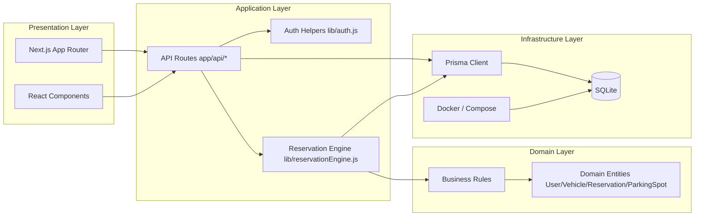

# Architecture Overview

## Layers

1. Presentation (Next.js UI): pages, components React, navigation et etats utilisateur.
2. Application: routes API, orchestration des requetes, controle d'acces, formatage des reponses.
3. Domain: regles metier de reservation (fenetre, no-show, PMR, anti-monopole).
4. Infrastructure: acces donnees via Prisma, persistance SQLite, execution conteneurisee.

## Data flow principal

1. Le client appelle une route API.
2. La route valide auth + entrees.
3. La logique metier calcule l'action autorisee.
4. Prisma lit/ecrit en base SQLite.
5. La reponse JSON (ou ICS) revient au client.
