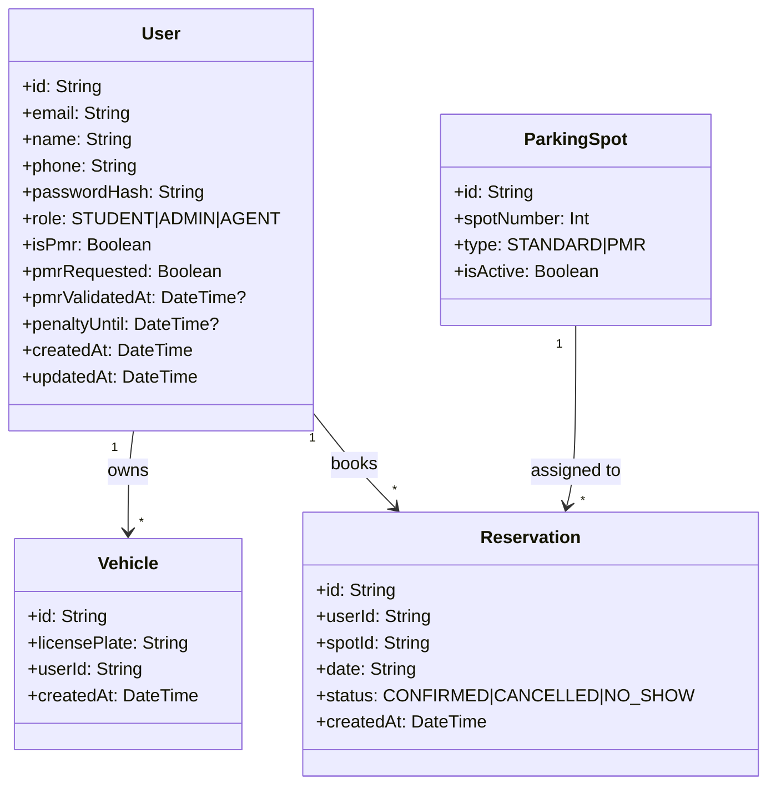

# Domain Model

## Contraintes importantes

- `User.email` unique
- `Vehicle.licensePlate` unique
- `ParkingSpot.spotNumber` unique
- Regles metier appliquees par le moteur:
	- une reservation active max par etudiant
	- fenetre de reservation 24h/48h selon contexte PMR
	- blocage no-show via `penaltyUntil`

Le schema Prisma dans `prisma/schema.prisma` est la source de verite du modele.
