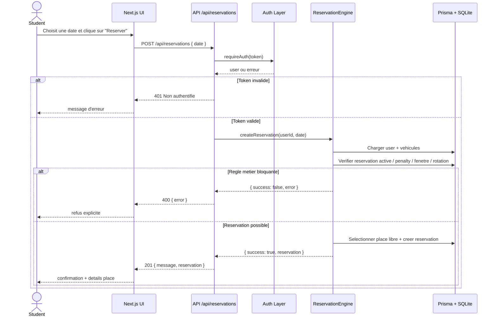

# Main User Flow - Sequence Diagram

```mermaid
sequenceDiagram
   actor Student
   participant UI as Next.js UI
   participant API as API /api/reservations
   participant Auth as Auth Layer
   participant Engine as ReservationEngine
   participant DB as Prisma + SQLite

   Student->>UI: Choisit une date et clique sur "Reserver"
   UI->>API: POST /api/reservations { date }
   API->>Auth: requireAuth(token)
   Auth-->>API: user ou erreur

   alt Token invalide
      API-->>UI: 401 Non authentifie
      UI-->>Student: message d'erreur
   else Token valide
      API->>Engine: createReservation(userId, date)
      Engine->>DB: Charger user + vehicules
      Engine->>DB: Verifier reservation active / penalty / fenetre / rotation

      alt Regle metier bloquante
         Engine-->>API: { success: false, error }
         API-->>UI: 400 { error }
         UI-->>Student: refus explicite
      else Reservation possible
         Engine->>DB: Selectionner place libre + creer reservation
         Engine-->>API: { success: true, reservation }
         API-->>UI: 201 { message, reservation }
         UI-->>Student: confirmation + details place
      end
   end
```
